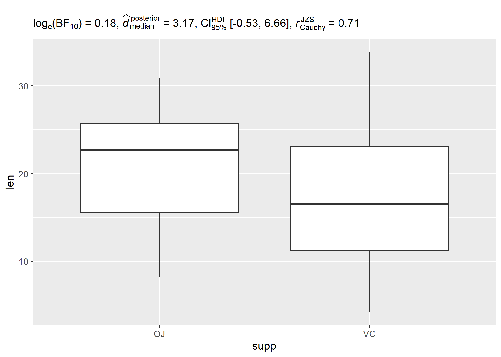
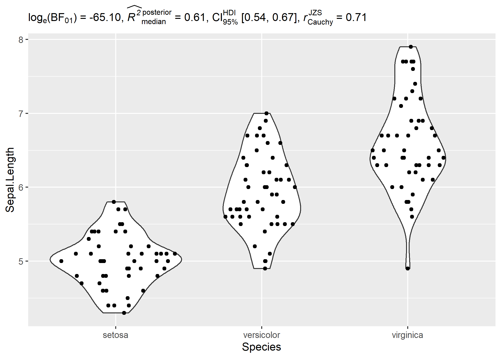
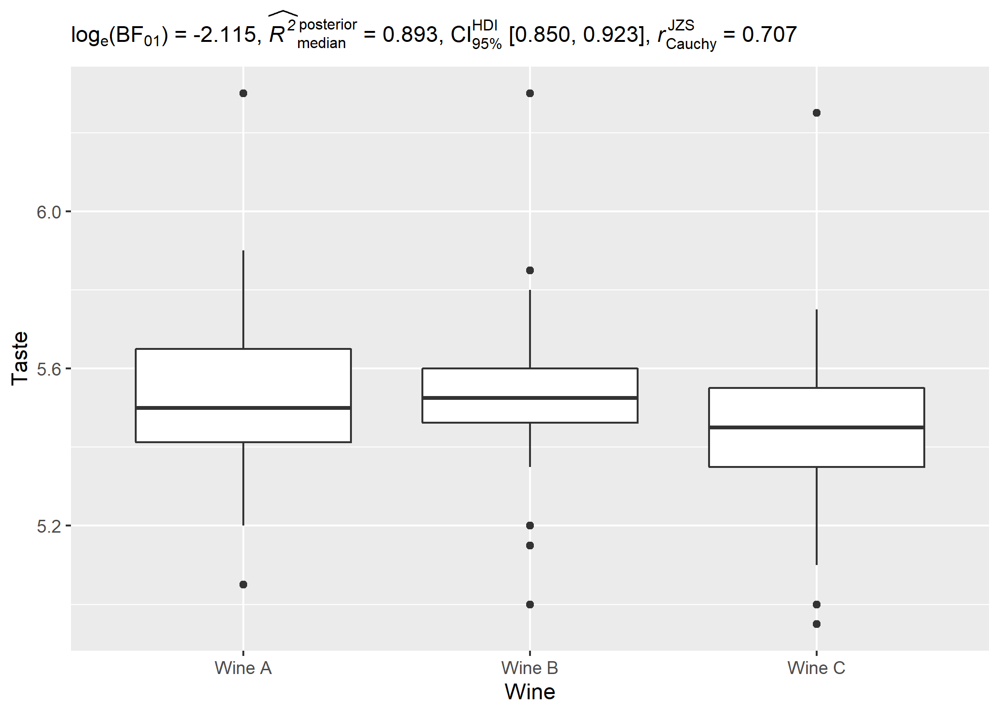
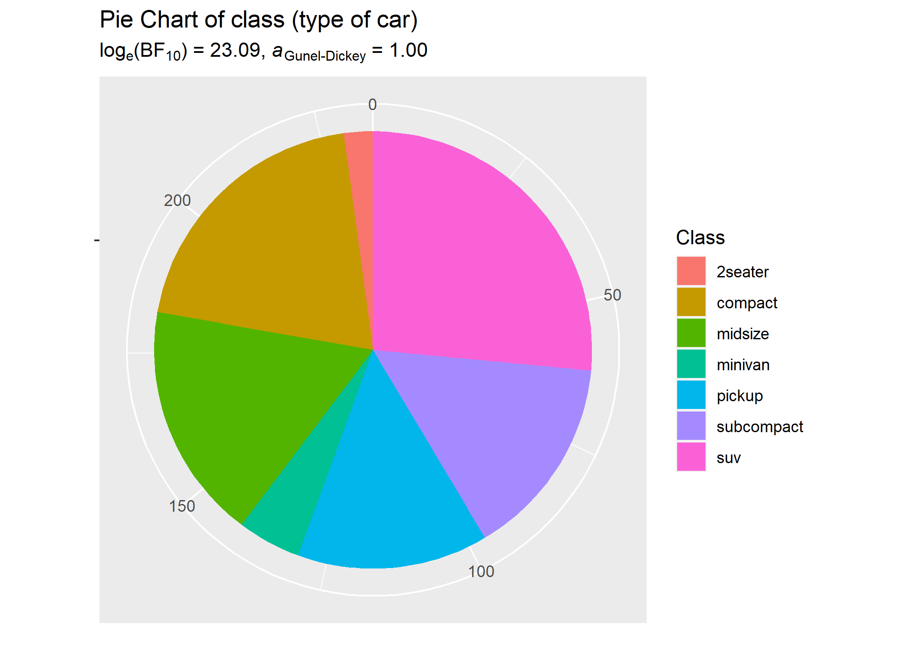
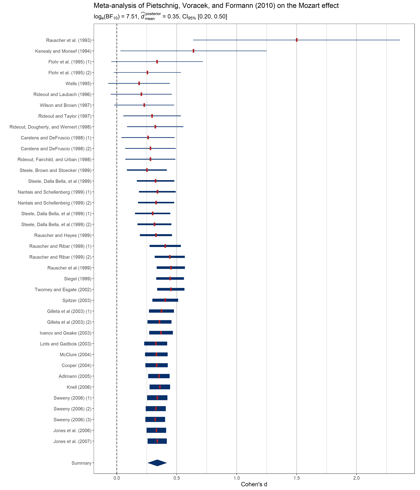

<!-- README.md is generated from README.Rmd. Please edit that file -->

# `tidyBF`: Tidy Wrapper for `BayesFactor` Package

[](https://github.com/IndrajeetPatil/tidyBF/commits/master)
[](https://CRAN.R-project.org/package=tidyBF)
[](https://CRAN.R-project.org/package=tidyBF)
[](https://CRAN.R-project.org/package=tidyBF)
[](https://CRAN.R-project.org/package=tidyBF)
[](https://travis-ci.org/IndrajeetPatil/tidyBF)
[](https://ci.appveyor.com/project/IndrajeetPatil/tidyBF)
[](https://www.gnu.org/licenses/gpl-3.0.en.html)
[](https://zenodo.org/badge/latestdoi/126624251)
[](https://www.repostatus.org/#active)
[](https://github.com/IndrajeetPatil/tidyBF/commits/master)
[](https://cran.r-project.org/)
[](https://codecov.io/github/IndrajeetPatil/tidyBF?branch=master)
[](https://coveralls.io/github/IndrajeetPatil/tidyBF?branch=master)

# Overview 

`tidyBF` package is a tidy wrapper around the `BayesFactor` package that
always expects the data to be in the tidy format and return a tibble
containing Bayes Factor values. Additionally, it provides a more
consistent syntax and by default returns a dataframe with rich details.
These functions can also return expressions containing results from
Bayes Factor tests that can then be displayed in custom plots.

# Installation

To get the latest, stable `CRAN` release:

``` r
install.packages("tidyBF")
```

You can get the **development** version of the package from `GitHub`. To
see what new changes (and bug fixes) have been made to the package since
the last release on `CRAN`, you can check the detailed log of changes
here: <https://indrajeetpatil.github.io/tidyBF/news/index.html>

If you are in hurry and want to reduce the time of installation, prefer-

``` r
# needed package to download from GitHub repo
install.packages("remotes")

remotes::install_github(
  repo = "IndrajeetPatil/tidyBF", # package path on GitHub
  quick = TRUE # skips docs, demos, and vignettes
)
```

If time is not a constraint-

``` r
remotes::install_github(
  repo = "IndrajeetPatil/tidyBF", # package path on GitHub
  dependencies = TRUE, # installs packages which `tidyBF` depends on
  upgrade_dependencies = TRUE # updates any out of date dependencies
)
```

# Summary of available tests

Behind the curtains, `tidyBF` provides an easier syntax to marry
functionalities provided by the following two packages in a unified
framework:

-   [`BayesFactor`](https://richarddmorey.github.io/BayesFactor/) : for
    hypothesis testing

-   [`bayestestR`](https://easystats.github.io/bayestestR/): for
    posterior estimation

| Analysis                        | Function             | Hypothesis testing             | Estimation                     | Function                          |
|---------------------------------|----------------------|--------------------------------|--------------------------------|-----------------------------------|
| (one/two-sample) t-test         | `bf_ttest`           | <font color="green">Yes</font> | <font color="green">Yes</font> | `BayesFactor::ttestBF`            |
| one-way ANOVA                   | `bf_oneway_anova`    | <font color="green">Yes</font> | <font color="red">No</font>    | `BayesFactor::anovaBF`            |
| correlation                     | `bf_corr_test`       | <font color="green">Yes</font> | <font color="green">Yes</font> | `BayesFactor::correlationBF`      |
| (one/two-way) contingency table | `bf_contingency_tab` | <font color="green">Yes</font> | <font color="red">No</font>    | `BayesFactor::contingencyTableBF` |
| random-effects meta-analysis    | `bf_meta`            | <font color="green">Yes</font> | <font color="green">Yes</font> | `metaBMA::meta_random`            |

# Notation

The results are always displayed as a Bayes Factor in favor of the
**null** hypothesis over the **alternative** hypothesis. Additionally,
the values are logged to avoid huge numbers. Therefore, the notation is:
").

Also, please note that this makes flipping the evidence easy:
")
= -
")

# Benefits

Below are few concrete examples of where `tidyBF` wrapper might provide
a more friendly way to access output from or write functions around
`BayesFactor`.

## Syntax consistency

`BayesFactor` is inconsistent with its formula interface. `tidyBF`
avoids this as it doesn’t provide the formula interface for any of the
functions.

``` r
# setup
set.seed(123)

# with `BayesFactor` ----------------------------------------
suppressPackageStartupMessages(library(BayesFactor))
data(sleep)

# independent t-test: accepts formula interface
ttestBF(formula = wt ~ am, data = mtcars)
#> Bayes factor analysis
#> --------------
#> [1] Alt., r=0.707 : 1383.367 ±0%
#> 
#> Against denominator:
#>   Null, mu1-mu2 = 0 
#> ---
#> Bayes factor type: BFindepSample, JZS

# paired t-test: doesn't accept formula interface
ttestBF(formula = extra ~ group, data = sleep, paired = TRUE)
#> Error in ttestBF(formula = extra ~ group, data = sleep, paired = TRUE): Cannot use 'paired' with formula.

# with `tidyBF` ----------------------------------------
library(tidyBF)

# independent t-test
bf_ttest(data = mtcars, x = am, y = wt)
#> # A tibble: 1 x 13
#>   term       estimate conf.low conf.high    pd rope.percentage
#>   <chr>         <dbl>    <dbl>     <dbl> <dbl>           <dbl>
#> 1 Difference    -1.26    -1.70    -0.820     1               0
#>   prior.distribution prior.location prior.scale effect component    bf10
#>   <chr>                       <dbl>       <dbl> <chr>  <chr>       <dbl>
#> 1 cauchy                          0       0.707 fixed  conditional 1383.
#>   log_e_bf10
#>        <dbl>
#> 1       7.23

# paired t-test
bf_ttest(data = sleep, x = group, y = extra, paired = TRUE, subject.id = ID)
#> # A tibble: 1 x 13
#>   term       estimate conf.low conf.high    pd rope.percentage
#>   <chr>         <dbl>    <dbl>     <dbl> <dbl>           <dbl>
#> 1 Difference     1.40    0.697      2.10 0.996               0
#>   prior.distribution prior.location prior.scale effect component    bf10
#>   <chr>                       <dbl>       <dbl> <chr>  <chr>       <dbl>
#> 1 cauchy                          0       0.707 fixed  conditional  17.3
#>   log_e_bf10
#>        <dbl>
#> 1       2.85
```

## Expressions for plots

Although all functions default to returning a dataframe, you can also
use it to extract expressions that can be displayed in plots.

### t-test

``` r
# setup
set.seed(123)
library(ggplot2)

# using the expression to display details in a plot
ggplot(ToothGrowth, aes(supp, len)) +
  geom_boxplot() + # two-sample t-test results in an expression
  labs(subtitle = bf_ttest(ToothGrowth, supp, len, output = "expression"))
```



### anova

``` r
# setup
set.seed(123)
library(ggplot2)
library(ggforce)
library(tidyBF)

# plot with subtitle
ggplot(iris, aes(x = Species, y = Sepal.Length)) +
  geom_violin() +
  geom_sina() +
  labs(subtitle = bf_oneway_anova(iris, Species, Sepal.Length, output = "expression"))
```



### correlation test

``` r
# setup
set.seed(123)
library(ggplot2)
library(tidyBF)

# using the expression to display details in a plot
ggplot(mtcars, aes(wt, mpg)) + # Pearson's r results in an expression
  geom_point() +
  geom_smooth(method = "lm") +
  labs(subtitle = bf_corr_test(mtcars, wt, mpg, output = "expression"))
#> `geom_smooth()` using formula 'y ~ x'
```



### contingency tabs analysis

``` r
# setup
set.seed(123)
library(ggplot2)
library(tidyBF)

# basic pie chart
ggplot(as.data.frame(table(mpg$class)), aes(x = "", y = Freq, fill = factor(Var1))) +
  geom_bar(width = 1, stat = "identity") +
  theme(axis.line = element_blank()) +
  # cleaning up the chart and adding results from one-sample proportion test
  coord_polar(theta = "y", start = 0) +
  labs(
    fill = "Class",
    x = NULL,
    y = NULL,
    title = "Pie Chart of class (type of car)",
    subtitle = bf_contingency_tab(as.data.frame(table(mpg$class)), Var1, counts = Freq, output = "h1")
  )
```



### meta-analysis

``` r
# setup
set.seed(123)
library(metaviz)
library(ggplot2)

# meta-analysis forest plot with results random-effects meta-analysis
viz_forest(
  x = mozart[, c("d", "se")],
  study_labels = mozart[, "study_name"],
  xlab = "Cohen's d",
  variant = "thick",
  type = "cumulative"
) + # use `statsExpressions` to create expression containing results
  labs(
    title = "Meta-analysis of Pietschnig, Voracek, and Formann (2010) on the Mozart effect",
    subtitle = bf_meta(dplyr::rename(mozart, estimate = d, std.error = se), output = "h1")
  ) +
  theme(text = element_text(size = 12))
```



## Convenient way to extract detailed output from `BayesFactor` objects

The package provides `bf_extractor` function to conveniently extract
important details from these objects:

``` r
# setup
set.seed(123)
library(tidyBF)
library(BayesFactor)
data(puzzles)

# model
result <-
  anovaBF(
    RT ~ shape * color + ID,
    data = puzzles,
    whichRandom = "ID",
    whichModels = "top",
    progress = FALSE
  )

# extract details
bf_extractor(result)
#> # A tibble: 21 x 13
#>    term                estimate conf.low conf.high    pd rope.percentage
#>    <chr>                  <dbl>    <dbl>     <dbl> <dbl>           <dbl>
#>  1 mu                    45.0    43.9      46.1    1               0    
#>  2 shape-round            0.429   0.131     0.741  0.992           0.141
#>  3 shape-square          -0.429  -0.741    -0.131  0.992           0.141
#>  4 color-color           -0.426  -0.711    -0.0995 0.990           0.162
#>  5 color-monochromatic    0.426   0.0995    0.711  0.990           0.162
#>  6 ID-1                   2.47    1.04      3.98   0.995           0    
#>  7 ID-2                   0.439  -1.02      1.78   0.698           0.231
#>  8 ID-3                   0.907  -0.501     2.32   0.848           0.156
#>  9 ID-4                   0.466  -0.959     1.98   0.704           0.218
#> 10 ID-5                   3.17    1.83      4.66   0.999           0    
#>    prior.distribution prior.location prior.scale effect component    bf10
#>    <chr>                       <dbl>       <dbl> <chr>  <chr>       <dbl>
#>  1 <NA>                           NA          NA fixed  extra       2.65 
#>  2 <NA>                           NA          NA fixed  conditional 0.233
#>  3 <NA>                           NA          NA fixed  conditional 0.239
#>  4 <NA>                           NA          NA fixed  conditional 2.65 
#>  5 <NA>                           NA          NA fixed  conditional 0.233
#>  6 <NA>                           NA          NA random conditional 0.239
#>  7 <NA>                           NA          NA random conditional 2.65 
#>  8 <NA>                           NA          NA random conditional 0.233
#>  9 <NA>                           NA          NA random conditional 0.239
#> 10 <NA>                           NA          NA random conditional 2.65 
#>    log_e_bf10
#>         <dbl>
#>  1      0.974
#>  2     -1.45 
#>  3     -1.43 
#>  4      0.974
#>  5     -1.45 
#>  6     -1.43 
#>  7      0.974
#>  8     -1.45 
#>  9     -1.43 
#> 10      0.974
#> # ... with 11 more rows
```

# Acknowledgments

The hexsticker was generously designed by Sarah Otterstetter (Max Planck
Institute for Human Development, Berlin).

# Code of Conduct

Please note that the `tidyBF` project is released with a [Contributor
Code of
Conduct](https://contributor-covenant.org/version/2/0/CODE_OF_CONDUCT.html).
By contributing to this project, you agree to abide by its terms.
